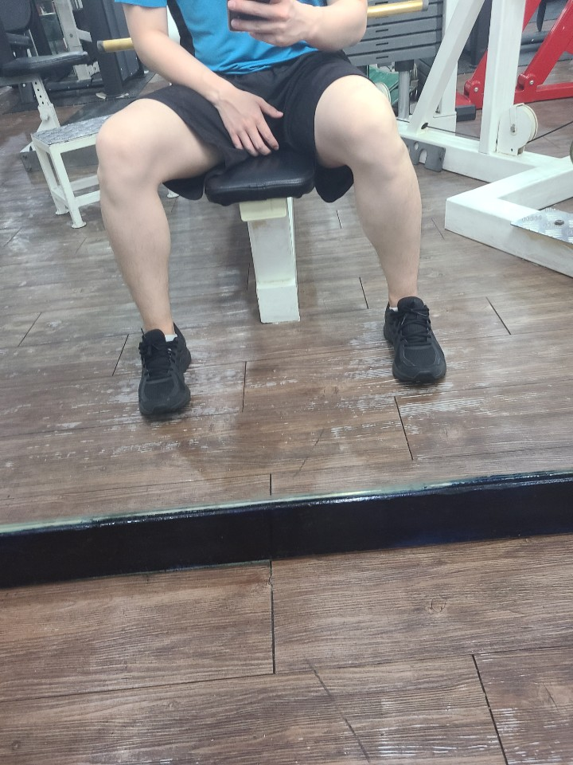
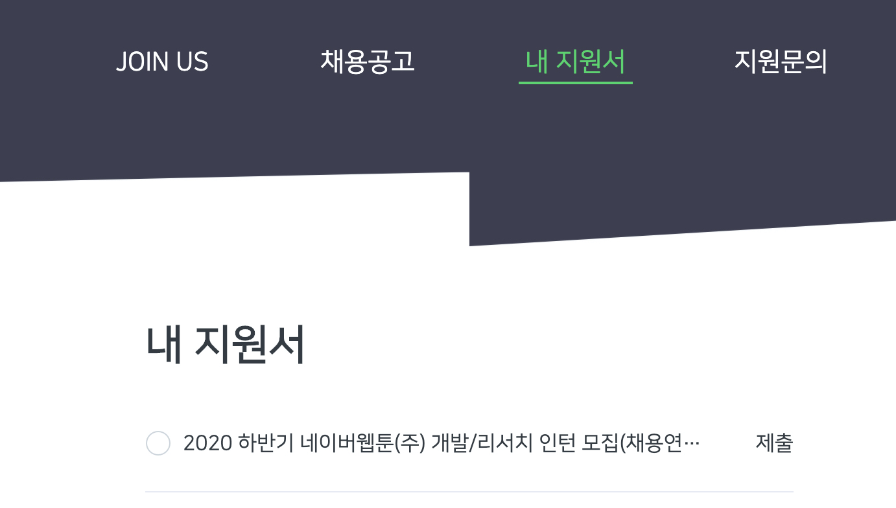

## 결과

1. 
2. 
3. [시작하세요 도커/쿠버네티스 2장 복습](start_docker_k8s_chapter2.md)

다음부터는 [타임스탬프 어플](https://play.google.com/store/apps/details?id=com.artifyapp.timestamp&hl=ko)로 헬스 사진을 찍어야겠다..
그냥 사진찍읜 다똑같이 생김