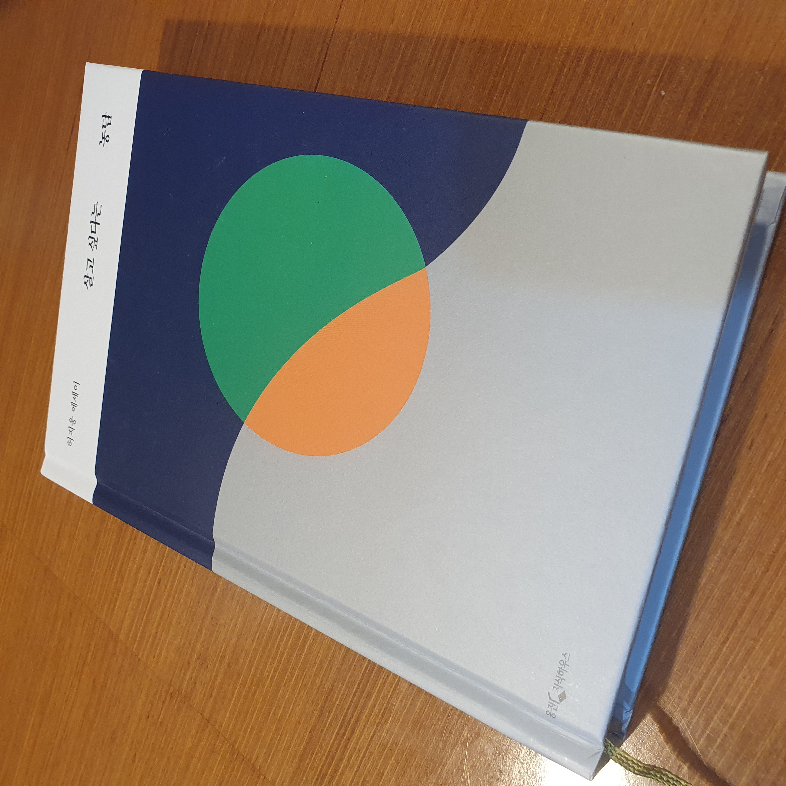

### 살고싶다는 농담

> 허지웅

예전에 마녀사냥에 나올 당시에 허지웅을 잠깐 좋아했었다. 특유의 시니컬함이 매력적이였는데 그 당시에 나도 시니컬함을 추종하고 있었기 때문이다. 이후로 나는 TV를 보지않아서 잘 몰랐는데 허지웅은 본업인 칼럼니스트로서는 그다지 존경받지 못했던 것 같다. 특유의 날카로운 문체와 냉소적인 내용으로 인해 공감을 얻어내지 못하고 쿨찐들만 양성해냈던 모양이다.

그런데 최근 인터넷 커뮤니티 등에서 허지웅의 인스타그램 전문이 올라오는 경우가 있어서 읽었는데, 잘 정리된 따뜻하고 공감가는 글이였다. 댓글에도 나와 같은 감상평을 남긴 사람들이 많았고 그가 투병생활 끝에 둥글고 따뜻해졌다고 말하는 사람들도 많았다. 그래서 호기심이 생겼다. 이 사람이 어떤 경험을 했기에 세상 혼자 살던 상처많은 외톨이 쿨찐이 환골탈태하여 사람들에게 따뜻함과 공감을 안겨주고 있을까? 그래서 읽기 시작했다.

현재까지 읽은 내용으로는 그냥 조온나 아팠다. 묘사가 좋다. 고통이 느껴질만큼

#### 다 읽고 나서...

큰 임팩트가 있거나, 집중해서 다 읽게 된다거나 그런 종류의 책은 아니다. 하지만 근래의 불안했던 내 마음이 이 책을 읽고 있을 때는 진정되는 느낌이였다. 내가 가진 불행보다 작가가 겪었던 불행이 더 크기 때문에 안심이되는 것 일까 또는 '정말 고통스러웠다' 라고 말하는 작가에게서 불행은 결국 지나가고 평온이 찾아온다는 것이 나를 진정시킨 것 일까

혹시, 마음이 불안한 사람이라면 옆에두고 눈에 밟힐때마다 책장을 넘겨보면 좋을 것 같다.

