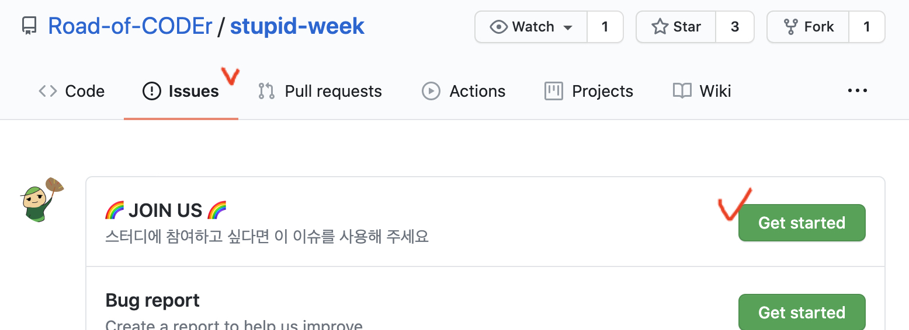

# 이번주에 나는 얼마나 장작을 태웠는가?

매 주 최소 3개의 목표를 설정하고 지키는 스터디.

함께 목표를 지키며 시너지를 내며 진정한 코더 땔감으로 거듭나는 것이 목표.

- [x] 3/4 분기 미팅: 현황 및 목표치 공유
- [x] 연말 회고(12월 중순): [Go to site](https://road-of-coder.github.io/year-end-2020)

### 함께 해요!

- 함께 성장 하실 분들을 모집하고 있습니다.👻 
- [가이드 라인](https://github.com/Road-of-CODEr/stupid-week/blob/master/.github/CONTRIBUTING.md)을 확인해 주세요!
- [Code of Conduct](https://github.com/Road-of-CODEr/stupid-week/blob/master/.github/CODE_OF_CONDUCT.md)

### LICENSE

This is released under the MIT license. See [LICENSE](LICENSE) for details.

#### Contributors

