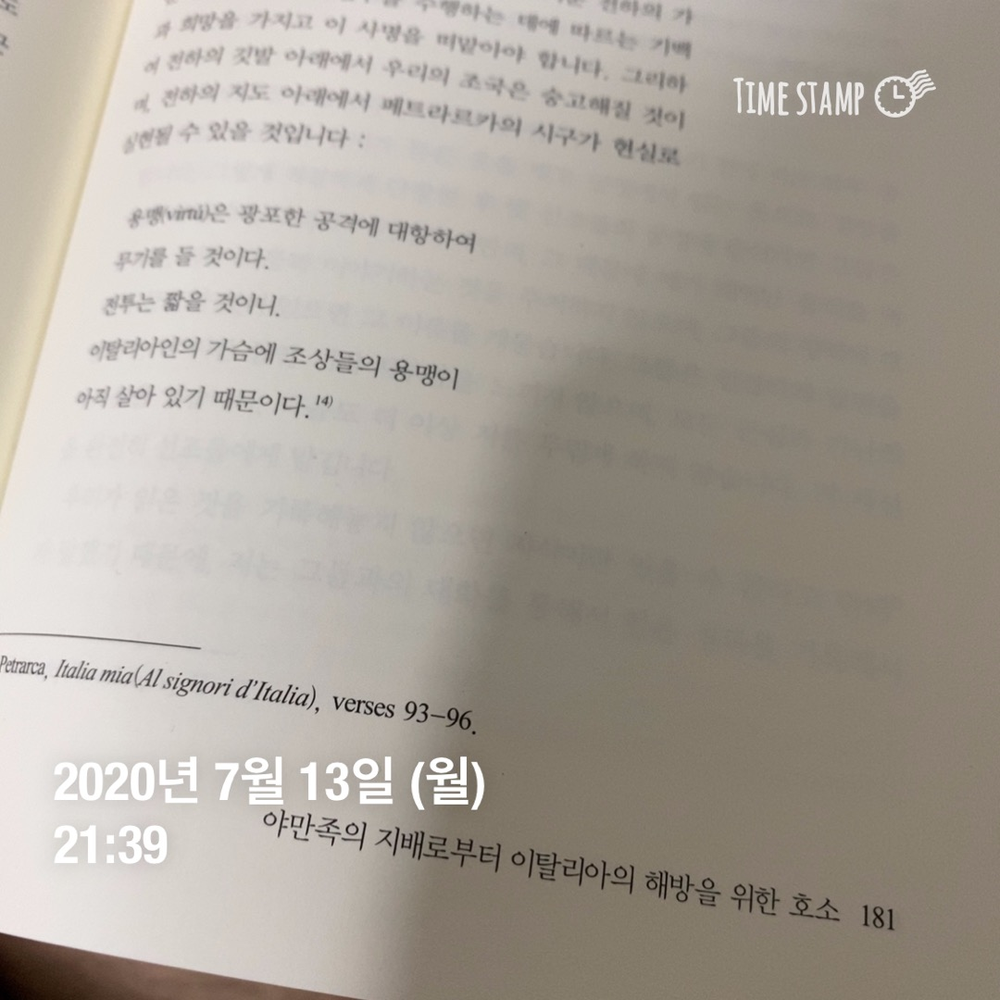
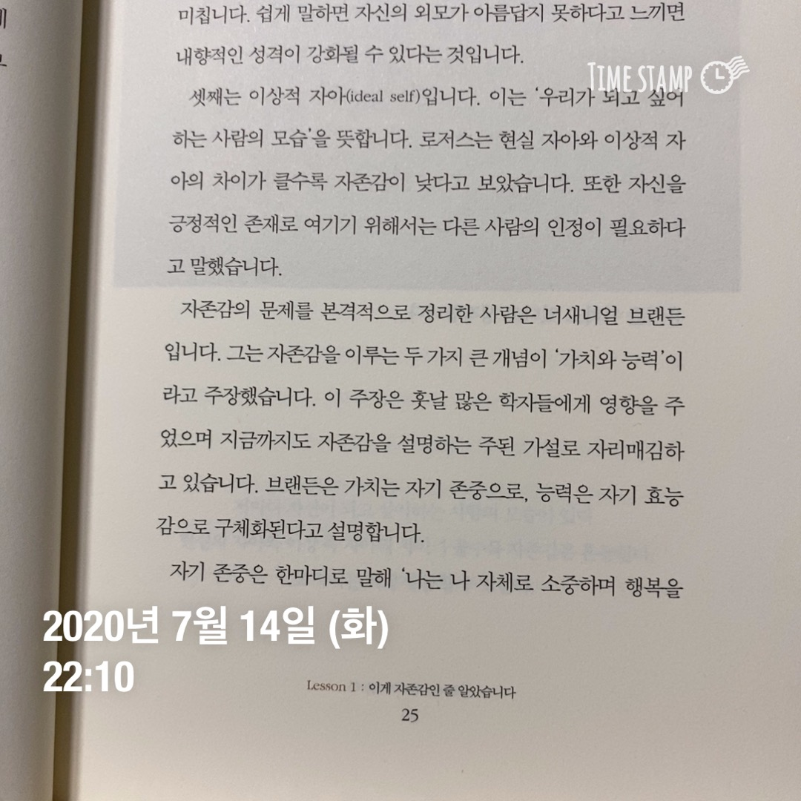
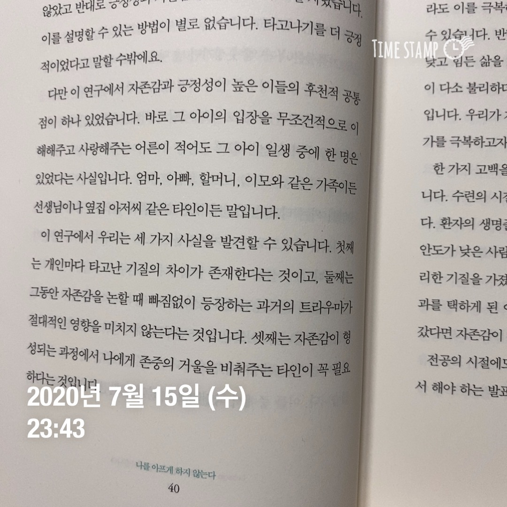
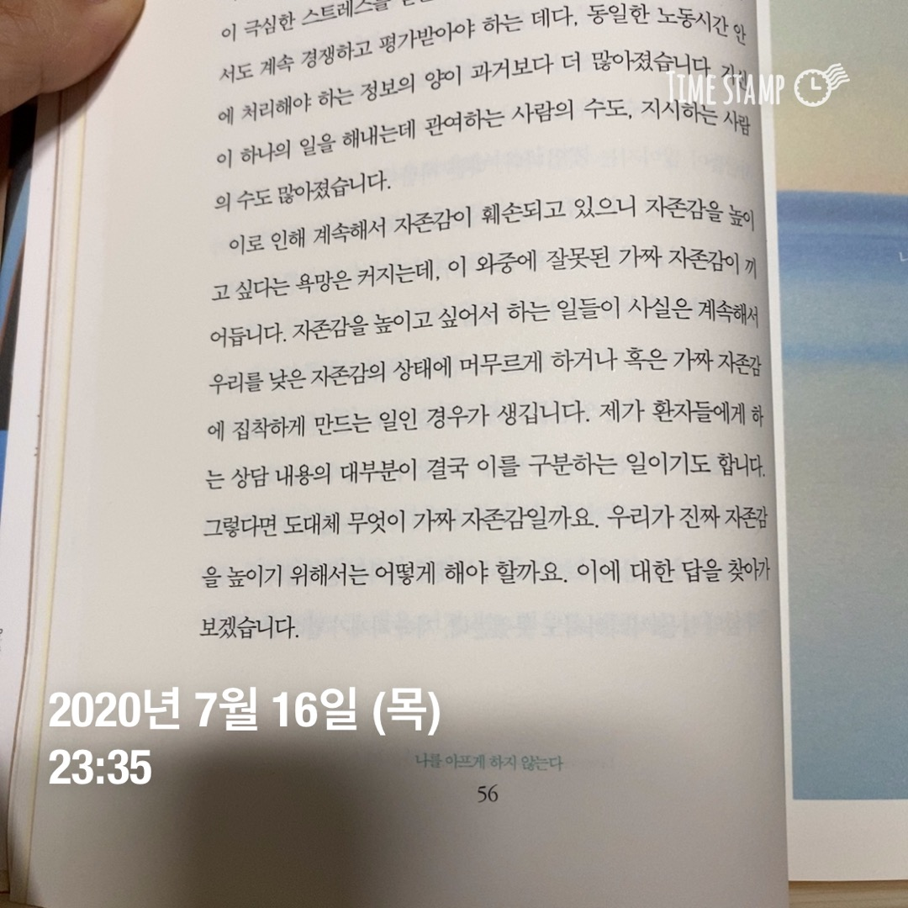
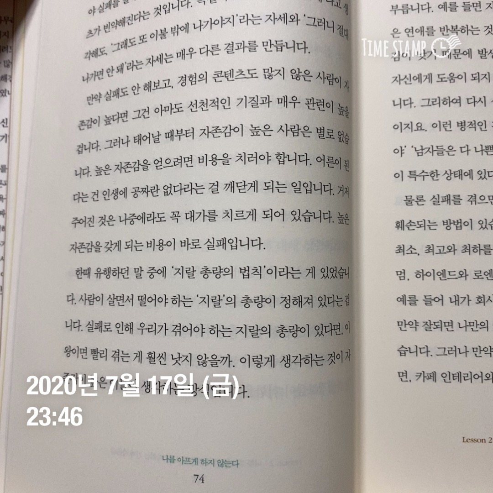

## Mental food

**7/13**

- 군주론 (완독)
- 용맹은 광포한 공격에 대항하여 무기를 들 것이다. 전투는 짧을 것이니. 이탈리아인의 가슴에 조상들의 용맹이 아직 살아 있기 때문이다.

**7/14**

- 나를 아프게 하지 않는다 (시작)
- 남이 나를 아프게 하는 건 피하려 해도 어쩔 수 없이 겪을 때가 있습니다. 하지만 적어도 내가 나를 상처 주는 일은 하지 않아야 할 것입니다.

**7/15**

- 다만 이 연구에서 자존감과 긍정성이 높은 이들의 후천적 공통점이 하나 있었습니다. 바로 그 아이의 입장을 무조건적으로 이해해주고 사랑해주는 어른이 적어도 그 아이 일생 중에 한 명은 있었다는 사실입니다.

**7/16**

- 자존감은 지능, 직업과 관련은 없지만 지성과는 깊은 관련이 있습니다. 지성이란 새로운 상황에 부딪혔을 때, 맹목적이거나 본능적인 방법이 아니라 지적인 사고에 근거하여 그 상황에 적응하고 과제를 해결하는 성질을 말합니다. 자존감은 일류대학과 전문직의 산물이 아니라, 지성의 산물입니다.

**7/17**

- 내 주변에 어떤 사람들이 있느냐에 따라 자존감이 결정되는 사람도 있다. 인생에서 남과의 비교를 통해 의미를 갖는 일을 최대한 적게 가져야 한다.

