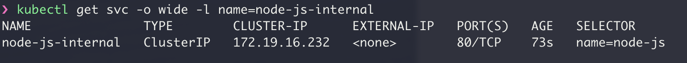

# K8s - 네트워킹, 로드 밸런서, 인그레스

쿠버네티스 네트워킹은 다음의 네 가지 문제를 해결한다.

1. 파드 내의 컨테이너는 루프백(loopback)을 통한 네트워킹을 사용하여 통신한다.
2. 클러스터 네트워킹은 서로 다른 파드 간의 통신을 제공한다.
3. 서비스 리소스를 사용하면 파드에서 실행 중인 애플리케이션을 클러스터 외부에서 접근할 수 있다.
4. 또한 서비스를 사용하여 클러스터 내부에서 사용할 수 있는 서비스만 게시할 수 있다.

## 쿠버네티스의 네트워킹 방식

- 컨테이너가 아닌 파드에 IP 주소 공간을 할당해 컨테이너 간의 통신을 분리한다.
- 쿠버네티스 네트워킹 모델의 주요 통신 패러다임은 파드 간의 통신 및 서비스
- 서비스 객체를 사용해 파드와 서비스, 파드와 외부 서비스 간에 통신

## 서비스

- 파드 집합에서 실행중인 애플리케이션을 네트워크 서비스로 노출하는 추상화 방법. 파드와 비슷한 REST 오브젝이다. 
- 모든 REST 오브젝트와 마찬가지로, 서비스의 정의는 API 서버에 `POST` 하여 새 인스턴스를 생성할 수 있다. 
- 서비스 오브젝트의 이름은 유효한 DNS 서브도메인 이름

### 가상 IP 와 서비스 프록시

쿠버네티스 클러스터의 모든 노드는 `kube-proxy` 를 실행한다. `kube-proxy` 는 서비스에 대한 가상 IP 형식을 구현한다.

**서비스에 프록시를 사용하는 이유**

라운드-로빈 DNS 사용하지 않고 프록시를 사용하는 데는 몇 가지 이유가 있다.

- 레코드 TTL을 고려하지 않고, 만료된 이름 검색 결과를 캐싱하는 DNS 구현에 대한 오래된 역사
- 일부 앱의 경우 DNS 검색을 한 번만 수행하고 결과를 무기한 캐시
- DNS 레코드의 TTL이 낮거나 0이면 DNS에 부하가 높아 관리하기 어렵다


### 다양한 `kube-proxy` 모드

#### User space 프록시 모드


kube-proxy는 쿠버네티스 마스터의 서비스, 엔트포인트 오브젝트의 추가와 제거를 감시

- 각 서비스는 로컬 노드에서 포드를 연다. 이 프록시 포트에 대한 모든 연결은 서비스의 백엔드 파드중 하나로 프록시 된다. 
- userspace 프록스는 서비스의 clusterIP 와 port에 대한 트래픽을 캡처하는 iptables 규칙을 설치한다. 이 규칙은 트래픽을 백엔드 파드를 프록시하는 프록시 포트로 리다이렉션한다.
- 기본적으로, 유저스페이스 모드의 kube-proxy는 라운드-로빈 알고리즘으로 백엔드를 선택한다.


#### iptables 프록시 모드


kube-proxy는 쿠버네티스 컨트롤 플레인의 서비스, 엔드포인트 오브젝트의 추가와 제거를 감시

- 각 서비스에 대해, 서비스의 `clusterIP` 및 `port`에 대한 트래픽을 캡처하고 해당 트래픽을 서비스의 백엔드 세트 중 하나로 리다이렉트하는 iptables 규칙을 설치한다.
- 기본적으로, iptables 모드의 kube-proxy는 임의의 백엔드를 선택한다.
- 트래픽을 처리하기 위해 iptables를 사용하면 시스템 오버헤드가 줄어드는데, 유저스페이스와 커널 스페이스 사이를 전환할 필요없이 리눅스 넷필터(netfilter)가 트래픽을 처리하기 때문이다. 

*주의할점*

- 첫 번째 파드에 대한 연결이 실패했을 때, 다른 파드로 재시도하는 기능이 없다.

*해결 방안*

- 파드의 readinessProbe를 사용하여 백엔드 파드가 제대로 작동하는지 확인할 수 있으므로, iptables 모드의 kube-proxy는 정상으로 테스트된 백엔드만 볼 수 있다.

> `readinessProbe`: 컨테이너가 요청을 처리할 준비가 되었는지 여부를 나타낸다. 만약 준비성 프로브(readiness probe)가 실패한다면, 엔드포인트 컨트롤러는 파드에 연관된 모든 서비스들의 엔드포인트에서 파드의 IP주소를 제거한다.

#### [IPVS 프록시 모드](https://kubernetes.io/ko/docs/concepts/services-networking/service/#proxy-mode-ipvs)

- Kubernetes v1.11 [stable] 부터 지원


> **sessionAffinity**
>
> 특정 클라이언트의 연결이 매번 동일한 파드로 전달되도록 설정할 수 있다.
> `service.spec.sessionAffinity`를 "ClientIP"로 설정하여 클라이언트의 IP 주소를 기반으로 세션 어피니티(Affinity)를 선택할 수 있다.


### 서비스 퍼블리싱 (ServiceTypes)

쿠버네티스 `ServiceTypes` 는 원하는 서비스 종류를 지정할 수 있도록 해준다.

- ClusterIP
  - 서비스를 클러스터-내부 IP에 노출시킨다. 클러스터 내에서만 서비스에 도달할 수 있다. 기본값
- NodePort
  - 고정 포트 (NodePort)로 각 노드의 IP에 서비스를 노출시킨다. `NodePort` 서비스가 라우팅되는 `ClusterIP` 서비스가 자동으로 생성된다. `<NodeIP>:<NodePort>`를 요청하여, 클러스터 외부에서 `NodePort` 서비스에 접속할 수 있다.
- LoadBalancer
  - 클라우드 공급자의 로드 밸런서를 사용하여 서비스를 외부에 노출시킨다. 외부 로드 밸런서가 라우팅되는 `NodePort`와 `ClusterIP` 서비스가 자동으로 생성된다.
- ExternalName
  - 값과 함께 CNAME 레코드를 리턴하여, 서비스를 `externalName` 필드의 콘텐츠 (예:`foo.bar.example.com`)에 매핑한다. 어떤 종류의 프록시도 설정되어 있지 않다.


#### ClusterIP (내부 서비스)

기본적으로 서비스는 내부로만 열려있다. 이를 위해 `clusterIP` 유형을 지정할 수 있지만 유형이 지정되지 않으면 기본으로 사용하게 된다.

```yaml
# nodejs-service-intenal.yaml
apiVersion: v1
kind: Service
metadata:
  name: node-js-internal
  labels:
    name: node-js-internal
spec:
  ports:
  - port: 80
  selector:
    name: node-js
```

```bash
$ kubectl create -f nodejs-service-internal.yaml
$ kubectl get services -l name=node-js-internal
```



```bash
$ kubectl exec node-js-pod -- curl <node-js-internal IP>
```


이 기능은 클러스터에서 실행 중인 다른 컨테이너에서만 사용할 수 있고 외부에는 개방하지 않는 백엔드 서비스에 유용하다.


#### NodePort (커스텀 로드 밸런싱)

`type: NodePort`로 설정하면, 쿠버네티스 컨트롤 플레인은 `--service-node-port-range` 플래그로 지정된 범위에서 포트를 할당한다 (기본값 : 30000-32767). 각 노드는 해당 포트 (모든 노드에서 동일한 포트 번호)를 서비스로 프록시한다. 서비스는 할당된 포트를 `.spec.ports[*].nodePort` 필드에 나타낸다.

NodePort를 사용하면 자유롭게 자체 로드 밸런싱 솔루션을 설정하거나, 쿠버네티스가 완벽하게 지원하지 않는 환경을 구성하거나, 하나 이상의 노드 IP를 직접 노출시킬 수 있다.

```yaml
# nodejs-service-nodeport.yaml
apiVersion: v1
kind: Service
metadata:
  name: node-js-nodeport
  labels:
    name: node-js-nodeport
spec:
  ports:
    # 기본적으로 그리고 편의상 `targetPort`는 `port` 필드와 동일한 값으로 설정된다.
  - port: 80
    # 선택적 필드
    # 기본적으로 그리고 편의상 쿠버네티스 컨트롤 플레인은 포트 범위에서 할당한다
    nodePort: 30001
  selector:
    name: node-js
  type: NodePort
```

```bash
$ kubectl create -f nodejs-service-nodeport.yaml
$ kubectl get svc -l name=node-js-nodeport
```


테스트하는 URL 유형

- http://{Node IP}:{Node Port}/

#### LoadBalancer (외부 서비스)

`type: LoadBalancer`  로 설정하면 외부 로드 밸런서를 지원하는 클라우드 공급자 상에서, 서비스에 대한 로드 밸런서를 프로비저닝한다.

```yaml
# nodejs-labels-service.yaml (2장 예제)
apiVersion: v1
kind: Service
metadata:
  name: node-js-labels
  labels:
    name: node-js-labels
    app: node-js-express
    deployment: test
spec:
  type: LoadBalancer
  ports:
  - port: 80
  selector:
    name: node-js-labels
    app: node-js-express
    deployment: test
```


> Type 필드는 중첩된 기능으로 설계되었다. - 각 레벨은 이전 레벨에 추가된다. 이는 모든 클라우드 공급자에 반드시 필요한 것은 아니지만, (예: Google Compute Engine은 LoadBalancer를 작동시키기 위해 NodePort를 할당할 필요는 없지만, AWS는 필요하다) 현재 API에는 필요하다.


**커스텀 포트**

서비스는 트래픽을 다른 포트로도 매핑할 수 있다.

```yaml
# nodejs-customPort-controller.yaml
apiVersion: v1
kind: ReplicationController
metadata:
  name: node-js-90
  labels:
    name: node-js-90
spec:
  replicas: 3
  selector:
    name: node-js-90
  template:
    metadata:
      labels:
        name: node-js-90
    spec:
      containers:
      - name: node-js-90
        image: jonbaier/node-express-info:latest
        ports:
        - containerPort: 80
        
# nodejs-customPort-service.yaml
apiVersion: v1
kind: Service
metadata:
  name: node-js-90
  labels:
    name: node-js-90
spec:
  type: LoadBalancer
  ports:
  - port: 90
    ## targetPort 지정
    targetPort: 80
  selector:
    name: node-js-90
```


**다중 포트 (Multi port)**

일부 서비스의 경우, 둘 이상의 포트를 노출해야 한다. 쿠버네티스는 서비스 오브젝트에서 멀티 포트 정의를 구성할 수 있도록 지원한다.

```yaml
# nodejs-multi-controller.yaml
apiVersion: v1
kind: ReplicationController
metadata:
  name: node-js-multi
  labels:
    name: node-js-multi
spec:
  replicas: 3
  selector:
    name: node-js-multi
  template:
    metadata:
      labels:
        name: node-js-multi
    spec:
      containers:
      - name: node-js-multi
        image: jonbaier/node-express-multi:latest
        ports:
        - containerPort: 80
        - containerPort: 8888
        
# nodejs-multi-service.yaml
apiVersion: v1
kind: Service
metadata:
  name: node-js-multi
  labels:
    name: node-js-multi
spec:
  type: LoadBalancer
  ports:
  - name: http
    protocol: TCP
    port: 80
  - name: fake-admin-http
    protocol: TCP
    port: 8888
  selector:
    name: node-js-multi
```

서비스에 멀티 포트를 사용하는 경우, 모든 포트 이름을 명확하게 지정해야 한다. 쿠버네티스의 일반적인 이름과 마찬가지로, 포트 이름은 소문자 영숫자와 `-` 만 포함해야 한다.


## 인그레스(Ingress)

- 클러스터 내의 서비스에 대한 외부 접근을 관리하는 API 오브젝트, 일반적으로 HTTP를 관리함
- 부하 분산, SSL 종료, 명칭 기반의 가상 호스팅을 제공할 수 있다.
- 트래픽이 서비스에 도달하기 전의 라우팅 경로에 있는 추가 레이어 or 홉(*hop*) 같은 것

인그레스는 클러스터 외부에서 클러스터 내부 서비스로 HTTP와 HTTPS 경로를 노출한다. 트래픽 라우팅은 인그레스 리소스에 정의된 규칙에 의해 컨트롤된다.

```
    internet
        |
   [ Ingress ]
   --|-----|--
   [ Services ]
```

인그레스 컨트롤러는 일반적으로 로드 밸런서를 사용해서 인그레스를 수행할 책임이 있으며, 트래픽을 처리하는데 도움이 되도록 에지 라우터 또는 추가 프런트 엔드를 구성할 수도 있다.

인그레스는 임의의 포트 또는 프로토콜을 노출시키지 않는다. HTTP와 HTTPS 이외의 서비스를 인터넷에 노출하려면 보통 Service.Type=NodePort 또는 Service.Type=LoadBalancer 유형의 서비스를 사용한다.


>  **Edge router**
>
> 클러스터에 방화벽 정책을 적용하는 라우터. 이것은 클라우드 공급자 똔느 물리적 하드웨어의 일부에서 관리하는 게이트웨이일 수 있다.


**전제 조건**

- 인그레스 리소스도 커스텀 로직을 수행하는 인그레스 **엔트리 포인트**, **인그레스 컨트롤러**가 필요하다
- ingress-nginx와 같은 인그레스 컨트롤러를 배포할 수 있고, 여러 인그레스 컨트롤러 중에서 선택할 수도 있다.


